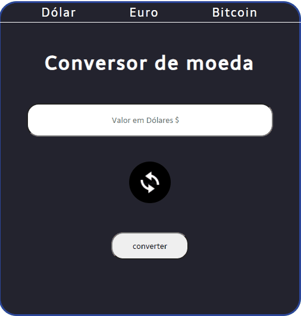

<h1 align="center" >Conversor de Moedas<h1>
<h2 align="center">Converte as principais moedas de hoje : dólar , euro e bitcoin. </h2>
<h1 > 🚀Features</h1>

✅ Converte Moedas dólar , euro e bitcoin para Reais ou ao contrario.

✅ Possui uma Api que é atualizada constantemente.

<h2 color="blue" align="center">
<a href="https://VitorHRD.github.io/Conversor-De-Moeda/">🔗 Conversor</a>
</h2

<h1 align="center">Programa funcionando<h1>
</img>
<h1>🚀 Tecnologias</h1>
 
 <ul>
     <li> HTML5
      <li> CSS3
       <li> JavaScript
 </ul>
 
<h1 > 🚀 Status do Projeto </h1>
 
 
 🚀 Conversor de moedas 🚀 Concluído 🚀 

 
 
 
Feito por Vitor Reis
